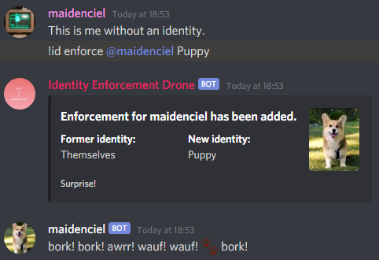

# Identities

(That's puppyspeak for "This is me with an identity").

Identities are created by users and enforced by the bot. For details on how to create an identity, check [the commands list](./COMMANDS.md).

Identities have many fields which are used for informational and enforcement purposes, which will be explained now:

## Name (name)
This is the name of the identity itself. It is used for reference purposes only. This is the identifier you will use when enforcing someone (e.g `!id enforce @maiden Drone`, where "Drone" is the name).

## Description (description)
Similar to name, this field is purely informational.

## Display Name (written as display_name)
This is the display name users enforced with your identity will have. If a user has the `display_name` of `Good toy`, then all the messages sent by them will appear to be sent by `Good toy`.

## Avatar (avatar)
If this attribute is set to a valid URL, it will replace the user's current avatar when enforcing an identity.  

## Replacement Lexicon (replacement_lexicon)

## Allowance Lexicon (allowance_lexicon)

## Strict (strict)

## Disallowance Lexicon (disallowance_lexicon)

## Override Lexicon (override_lexicon)

## Override Chance (override_chance)