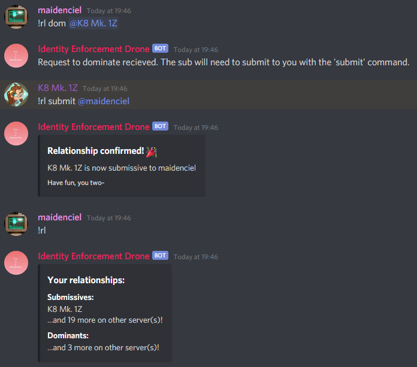

# Relationships

In order to puppet someone or enforce them with an identity, you must first be dominating them, and they must be submitting to you. This two-way system (hopefully) ensures a decent level of consent. A dominant must `!rl dom` their submissive, and the submissive must reciprocate with `!rl sub` before any fun can begin. See [the commands page](COMMANDS.md) for more precise information.

Both the submissive and dominant can end a relationship at any time using the `!rl relinquish` command. If the submissive was enforced with an identity then it will also be unenforced at this time.

Stay safe, and have fun.